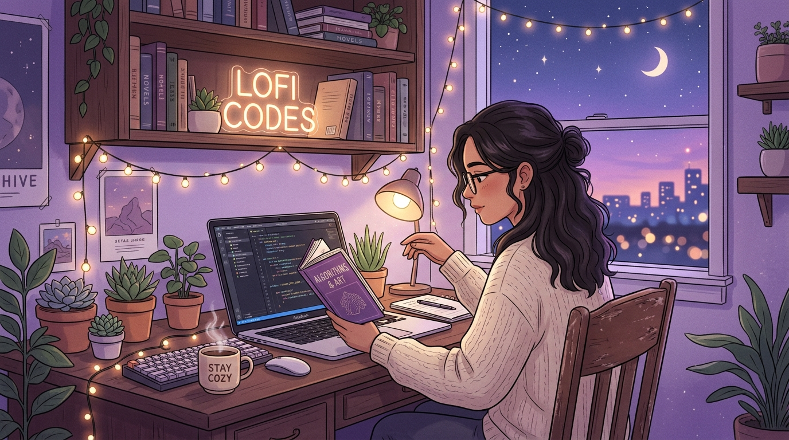

<!-- HEADER ANIMATION -->

<!-- HERO INTRO / ABOUT (SIDE-BY-SIDE) -->
<table>
  <tr>
    <td valign="top" width="56%">
       
      
        
      <ul>
        <li>🎓 <b>Education</b> — Computer Science & Engineering Undergrad</li>
        <li>💻 <b>Frontend Focus</b> — Crafting clean, responsive, and aesthetic user interfaces</li>
        <li>🌱 <b>Learning Backend</b> — Actively exploring Node.js, Express, Firebase & APIs</li>
        <li>🚀 <b>Full-Stack Aspirations</b> — Exploring new web tech to become a Full-Stack Developer</li>
        <li>📚 <b>Novel Reader</b> — Passionate about fiction, fantasy, and immersive stories</li>
        <li>☕ <b>Vibe</b> — Cozy lofi tunes, ambient lighting, and warm coffee</li>
      </ul>
    </td>
    <td valign="middle" align="center" width="44%">
      
    </td>
  </tr>
</table>

  <i>"✨ Turning caffeine, curiosity, and code into aesthetic digital experiences."</i>

---

### 💻 `Tech Stack & Tooling`

#### ✨ **Frontend Development**

  
  
  
  
  
  

#### ⚙️ **Backend & Database (Currently Learning)**

  
  
  
  

#### 🛠️ **Developer Tools & Environment**

  
  
  
  
  
  

---

### 📊 `GitHub Analytics & Activity`

  <!-- GITHUB OVERVIEW & TOP LANGUAGES -->
  

    
    
  

  <!-- STREAK STATS -->
  

    
  

  <!-- CONTRIBUTION GRAPH -->
  

    
  

  <!-- CONTRIBUTION SNAKE -->
  

    
  

---

### 📚 `Cozy Corner & Interests`

| 📖 **Reading Corner** | 🎧 **Vibe & Flow** | 💡 **Core Values** |
| :--- | :--- | :--- |
| • Fiction & Fantasy Novels • Thrillers & Page-Turners • Literary & Mystery Books | • Lofi Chill Beats • Deep Focus Ambient • Late Night Coding Sessions | • Pixel-Perfect Frontend • Continuous Learning • Clean & Scalable Code |

---

### 🌐 `Connect & Collaborate`

  
  
  

  <i>💬 Have a project in mind or just want to chat about books and tech? Feel free to reach out!</i>

<!-- FOOTER WAVE -->

